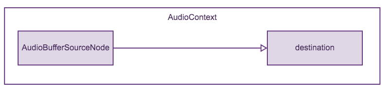
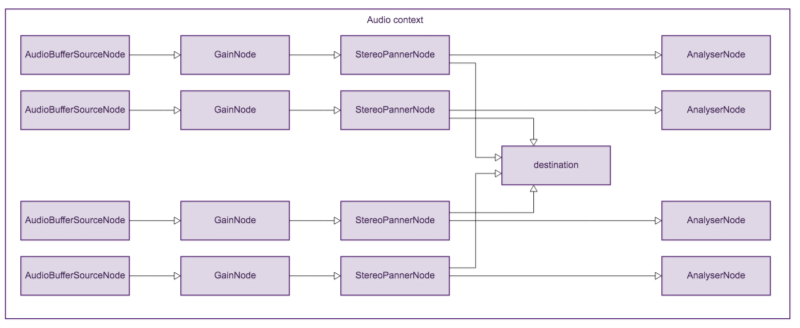
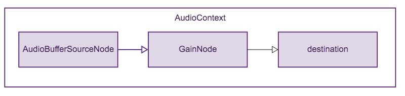

As I usually do after wrapping up a long-term consulting project, I recently took a long break from work to level-up my programming skills. On my list of technologies to muck around with were Angular 2, TypeScript, and RxJS.

I like to have a small, fun project to hack on when I’m learning a new framework or programming language. This time I decided to combine my love for music production and the web platform to build a rudimentary sampler in the web browser.

A [sampler](https://en.wikipedia.org/wiki/Sampler_%28musical_instrument%29) is a musical instrument that allows a musician to load audio recordings into memory and play them back using a bank of pressure-sensitive pads or a [MIDI controller](https://en.wikipedia.org/wiki/MIDI_keyboard). These recordings can be simple percussive sounds — such as snare drums, kicks, hi-hats, etc. — or sections of existing songs. Once they’ve been loaded into the sampler, these recordings — or samples — can be [rearranged to create entirely new songs](https://en.wikipedia.org/wiki/Sampling_%28music%29). For example, here’s a video of a musician creating a hip-hop beat using audio samples from several sources on an Akai MPC2000 XL:

https://youtu.be/Aw70LqYUUCY

While most genres of music make use of samplers in one way or another, their use is especially prevalent in hip-hop and the myriad sub-genres of EDM.

Before Moore’s Law turned the personal computer into a full-featured music production studio, artists composed their tracks using hardware samplers such as Akai’s legendary MPC or Ensoniq’s SP1200. Modern day artists are more likely to use software samplers running on their laptops or even iPads over bulky pieces of hardware.

In this series of tutorials, we’ll build exactly that: a software sampler that runs inside your web browser. Once we’re done, our sampler will be able to load audio samples, change their playback rates and volumes, apply simple effects to them, and play them back in response to events from a MIDI controller or a computer keyboard.

We’ll use Angular 2 as our web framework, the WebAudio API to process and play back audio, and the WebMIDI API to talk to our MIDI controller.

To begin with, let’s go over a few Angular 2 and WebAudio fundamentals.

## Set up an Angular 2 Project

If you have no prior experience with Angular 2, I would recommend that you at least read the [official Angular quickstart](https://angular.io/docs/ts/latest/quickstart.html) and [setup guide](https://angular.io/docs/ts/latest/guide/setup.html) before moving forward with this tutorial.

Done? You should have ended up with a simple Hello World type app backed by a build system that automatically recompiles your code and reloads the browser every time a file is modified. Hang on to this code, we’ll build our sampler on top of it.

At this point, you might want to go into `styles.css` and nuke the contents.

## Play a Sound with the WebAudio API

The WebAudio API lets you play, synthesize, manipulate, and monitor audio in the browser with an incredible amount of precision and control. Instead of going into the theory behind the API, I’m going to take a code-first approach and explain parts of the API as we use them to build our sampler.

To begin with, let’s look at the simplest use case for WebAudio: loading an audio file from a URL and playing it back.

In this tutorial we’ll load a single sample from a URL and play it back when a button is clicked.

### Create an AudioContext

Open `app.component.ts` from the quickstart in your text editor. It should look like this:

import { Component } from '@angular/core';

@Component({
    selector: 'my-app',
    template: \`<h1>Hello {{name}}</h1>\`,
})

export class AppComponent  { name = 'Angular'; }

In order to do anything at all with the WebAudio API, we must create a new instance of `AudioContext`. We’ll talk about what `AudioContext` does in a bit. For now, just follow along.

Let’s create the `AudioContext` right after Angular has finished initializing our `AppComponent`.

import { Component, OnInit } from '@angular/core';

@Component({
    selector: 'my-app',
    template: \`\`,
})
export class AppComponent implements OnInit  {
    private audioContext: AudioContext;
    ngOnInit() {
        this.audioContext = new AudioContext();
    }
}

In the code above, our `AppComponent` implements the `OnInit` interface, which defines a single method: `ngOnInit()`. This is a lifecycle hook that is invoked after the component has been initialized and all of its inputs and output bindings (more on these later) are live.

`ngOnInit()` is a great place to create our `AudioContext`. In the code above, we declare a property called `audioContext` on `AppComponent` and initialize it inside `ngOnInit()`.

Initializing an `AudioContext` is simple: we call `new AudioContext()` and we’re on our way.

### Lifecycle what?

From the moment it’s created to the moment it’s destroyed, each Angular 2 component has a lifecycle that’s managed by the framework itself. For each stage in its lifecycle, a component can implement a method called a lifecycle hook that gives it a chance to implement custom behavior during that stage. For a full list of lifecycle hooks that Angular invokes, read the [chapter on lifecycle hooks](https://angular.io/docs/ts/latest/guide/lifecycle-hooks.html) in the documentation.

Why did we initialize `audioContext` inside `ngOnInit()` when we could have done it inside `AppComponent`’s constructor? A component’s input and output bindings are undefined at the time its constructor is called. If your initialization code depends on the values of these bindings, it will fail if you put it inside the constructor. By the time `ngOnInit()` is called, all the input and output bindings have been checked for modifications once and are ready for use.

Our simple example doesn’t declare any bindings on `AppComponent` so it doesn’t matter where we put our initialization code, but putting it in `ngOnInit` is good practice and you should get used to doing it early on.

### Fetch Audio Data from a URL

Even though Angular comes with its own HTTP library located in the `angular2/http` module, we’re not going to use it for this tutorial. As of this writing, the library does not support loading data into `<a href="https://developer.mozilla.org/en-US/docs/Web/JavaScript/Reference/Global_Objects/ArrayBuffer">ArrayBuffers</a>` without resorting to ugly hacks.

If you’re reading this in the future and the Angular team has added support for `ArrayBuffers` to the HTTP library, leave a comment on this article or write to me at [contact@ankursethi.in](mailto:contact@ankursethi.in) and I will update this section. For now, we’ll use a simple `fetch()` to download our audio sample.

Let’s add a new method to `AppComponent`:

fetchSample(): Promise<AudioBuffer> {
    return fetch('samples/snare.wav')
        .then(response => response.arrayBuffer())
        .then(buffer => {
            return new Promise((resolve, reject) => {
                this.audioContext.decodeAudioData(
                    buffer,
                    resolve,
                    reject
                );
            })
        });
}

We begin by fetching the audio sample from a URL using `<a href="https://developer.mozilla.org/en/docs/Web/API/Fetch_API">fetch()</a>`. Then, we call `arrayBuffer()` on the response object to read the response data into a new `ArrayBuffer`. We now have a reference to a buffer containing binary audio data stored in `snare.wav`. However, `.wav` is not an audio format that the WebAudio API understands. In fact, the only format the WebAudio API understands is [linear PCM](https://en.wikipedia.org/wiki/Pulse-code_modulation). Before we can play our file, we must somehow turn it into linear PCM. But how?

We use the `decodeAudioData()` method on our `AudioContext` to decode the data and create a new `AudioBuffer` object. This object contains the PCM data we’re looking for. In the end, our `fetchSample()` method returns a `Promise` that resolves with the `AudioBuffer`.

Let’s load the sample when our component is initialized. At the same time, let’s add a play button to the web page. It’s a good idea to disable the play button while the sample is loading.

Change the component’s template so it looks like this:

\`<button \[disabled\]='loadingSample'>play</button>\`

The `[disabled]='loadingSample'` syntax is a form of one-way data binding called property binding. This code binds the `disabled` property of the play button to the value of `loadingSample` on our `AppComponent` instance. The direction of data flow is from the component class to the template, i.e, any change to the `loadingSample` property inside the component instance will reflect in the template, but not the other way round.

Now add the `loadingSample` property to `AppComponent`. Also add an additional property called `audioBuffer` to store a reference to our decoded audio data.

export class AppComponent  implements OnInit {
    private audioContext: AudioContext;
    private loadingSample: boolean = false;
    private audioBuffer: AudioBuffer;

    ngOnInit() {
        this.audioContext = new AudioContext();
    }

    fetchSample(): Promise<AudioBuffer> {
        return fetch('samples/snare.wav')
            .then(response => response.arrayBuffer())
            .then(buffer => {
                return new Promise((resolve, reject) => {
                    this.audioContext.decodeAudioData(
                        buffer,
                        resolve,
                        reject
                    );
                })
            });
    }
}

Finally, call `fetchSample()` inside `ngOnInit()`:

ngOnInit() {
    this.audioContext = new AudioContext();

    this.loadingSample = true;
    this.fetchSample()
        .then(audioBuffer => {
            this.loadingSample = false;
            this.audioBuffer = audioBuffer;
        })
        .catch(error => throw error);
}

We’re ready to play our sample!

### Play a Sample

Add a new method to the component:

playSample() {
    let bufferSource = this.audioContext.createBufferSource();
    bufferSource.buffer = this.audioBuffer;
    bufferSource.connect(this.audioContext.destination);
    bufferSource.start(0);
}

We start out by creating a new instance of `AudioBufferSourceNode` and setting its `buffer` property to the `audioBuffer` we created in the previous section. An instance of `AudioBufferSourceNode` represents a source of audio in the PCM format stored inside an `AudioBuffer`.

Next, we connect `bufferSource` to the `destination` of our `audioContext`. More on this in the next section.

Finally, we tell the `bufferSource` to play the audio stored in `audioBuffer` immediately by calling `bufferSource.start(0)`.

That’s it. The only thing we need to do now is to call our `playSample()` method when the play button is clicked. But first, let’s take a step back and talk about the WebAudio API.

## Audio Contexts and Audio Nodes in the WebAudio API

All audio operations in the WebAudio API happen inside an `AudioContext`, an object representing a graph of audio processing nodes. Each audio processing node in this graph is responsible for performing a single operation on the audio signal that flows through it. The API defines nodes for generating audio signals, controlling volume, adding effects, splitting stereo channels, analyzing audio frequency and amplitude, etc. In code, these audio processing nodes are represented by objects that implement the `AudioNode` interface.

Our journey through the audio processing graph begins at an audio source node, a type of audio node that represents a source of audio. We’ve already seen one type of audio source node in this tutorial: the `AudioBufferSourceNode`.

The signal from an audio source node can be piped into an instance of an `AudioDestinationNode` using `AudioNode`’s `connect()` method. In `playSample()`, we pipe the output of our `AudioBufferSourceNode` to the `destination` property of our `AudioContext`. This property is an instance of an audio destination node that represents the computer’s currently selected audio output device. The audio processing graph created by `playSample()` looks like this:

This is the simplest audio processing graph possible, consisting of only a source of audio and a destination. In reality, we’re not limited to just two audio nodes per audio context. Before our audio signals exits the graph at an audio destination node, it could pass through a number of audio effect nodes or analyzer nodes that change the nature of the audio signal in significant ways.

Here’s an example of a more complex audio graph:

As we add more features to our sampler, we’ll talk about the different kinds of audio nodes available to us and use them to construct more complex audio graphs. For now, this is all you need to know to start using the WebAudio API.

With that out of the way, let’s move on and add a click handler to our play button so we can finally hear our audio sample.

## Add a Button with a Click Handler

Modify the `AppComponent` template to look like this:

\`<button (click)='onClick()'
         \[disabled\]='loadingSample'>play</button>\`

Then, add a new method to `AppComponent`:

onClick() {
    this.playSample();
}

The `(click)='onClick()'` syntax is a form of one way binding called event binding. It’s used to declare an expression that is executed in the scope of the component when an event occurs in its view. In this case, we call the `onClick()` method on `AppComponent` when our button is clicked.

Refresh your browser and click the play button. Congratulations, you’ve just loaded and played an audio file using the WebAudio API!

## Adjust Playback Speed

Adjusting the playback speed of the audio sample is a simple matter of changing bufferSource’s `playbackRate` property. Let’s add a private variable to our component:

private playbackRate: number = 1.0;

Add a range input to the template:

  <button (click)='onClick()' 
          \[disabled\]='loadingSample'>play</button>

  <input type='range'
         min='0.01'
         max='5.0'
         step='0.01'
         \[(ngModel)\]='playbackRate'>

Since the `ngModel` directive is part of Angular’s `FormsModule`, we need to inject it into our application. At the top of `app.module.ts`, add:

import { FormsModule } from '@angular/forms';

Then, edit the `imports` section of the configuration passed to the `NgModule` decorator so that it includes `FormsModule`:

imports: \[ BrowserModule, FormsModule \]

So far in this tutorial we’ve worked with two kinds of bindings: event bindings and property bindings. Both of these are forms of one-way binding.

The `[(ngModel)]='playbackRate'` syntax in the code above is a form of two-way binding. Here, we’re telling Angular to update the value of our component’s `playbackRate` property whenever the user moves the range input, and to update the value reflected by the range input whenever the user changes the component’s `playbackRate` property. `ngModel` is a built-in Angular directive that makes this possible.

Finally, change the `playSample()` code so it sets the playback rate of `bufferSource` before playing the sample:

playSample() {
    let bufferSource = this.audioContext.createBufferSource();
    bufferSource.buffer = this.audioBuffer;
    bufferSource.playbackRate.value = this.playbackRate;
    bufferSource.connect(this.audioContext.destination);
    bufferSource.start(0);
}

Now try moving the playback rate slider and clicking the play button.

## Adjust Playback Volume

To control the playback volume of our sample, we’ll add an audio processing node called `GainNode` between the `AudioBufferSourceNode` and the destination of our `AudioContext`. After we’re done, our audio processing graph will look like this:

`GainNode` can be used to boost or attenuate the audio signal that passes through it. A gain of 1.0 means no change in the audio signal. A gain greater than 1.0 means the signal will be boosted (often causing unwanted distortions in the signal), and a gain of less than 1.0 means the signal will be attenuated.

First, add a property called `gain` to the component:

private gain: number = 1.0;

Next, add another slider to the template and bind its value to `gain`:

  <button (click)='onClick()' 
          \[disabled\]='loadingSample'>play</button>

  <label for='playbackRate'>Playback rate:</label>
  <input type='range'
         id='playbackRate'
         min='0.01'
         max='5.0'
         step='0.01'
         \[(ngModel)\]='playbackRate'>

  <label for='gain'>Volume:</label>
  <input type='range'
         id='gain'
         min='0.01'
         max='5.0'
         step='0.01'
         \[(ngModel)\]='gain'>

It’s a good idea to add labels to the `gain` and `playbackRate` sliders so we know which one is which.

Finally, modify the audio graph in `playSample()`:

playSample() {
    let bufferSource = this.audioContext.createBufferSource();
    bufferSource.buffer = this.audioBuffer;
    bufferSource.playbackRate.value = this.playbackRate;

    let gainNode = this.audioContext.createGain();
    gainNode.gain.value = this.gain;

    bufferSource.connect(gainNode);
    gainNode.connect(this.audioContext.destination);

    bufferSource.start(0);
}

Now try moving the volume slider and clicking the play button.

## Next Steps

In addition to the basics of the WebAudio API, this tutorial covered lifecycle hooks, event bindings, property bindings, and two-way bindings in Angular 2.

In the next tutorial, we’ll learn how to trigger our sample using a MIDI controller or computer keyboard.