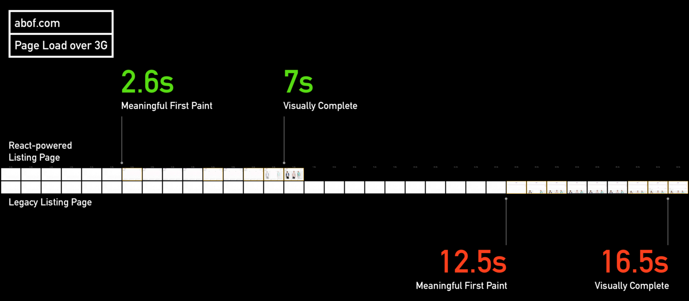

_This case study was first published on the Alaris Prime blog on June 8, 2016. You can [read the original case study here](https://alarisprime.blog/e-commerce-case-study-building-faster-listing-pages-on-abof-com-part-1-cb99231a1e8a)._

[abof.com](https://abof.com) (pronounced _ae-boff dot com_) is an online fashion store that’s part of [Aditya Birla Group’s](https://en.wikipedia.org/wiki/Aditya_Birla_Group) e-commerce strategy. Earlier this year, the company brought in the [Alaris Prime](https://alarisprime.com/) [team](https://alarisprime.com/team) along with [Ciju](https://github.com/ciju) from [ActiveSphere Technologies](http://activesphere.com/) for a complete rewrite of the product listing page on abof.com. After we delivered the rewrite, the load times for the page on 3G connections went from ~20 seconds to ~7 seconds, and bounce rates decreased by over 40%. These improvements have encouraged abof to invest a significant chunk of their technology resources into web performance, in particular the React and Redux ecosystem.

In this three-part case study, I will talk about abof’s motivations for the rewrite, the technology choices our team made to meet abof’s business goals, our rationale for the choices we made, and our experiences with React, Redux, and the ecosystem that has emerged around these libraries.

## Motivation

Most Indians access the web using mobile phones, and this fact is reflected in the analytics data collected on abof.com: at the time we started working with abof, more than 60% of the website’s traffic came from mobile users.

While the legacy version of the website adequately served the needs of desktop users, it had three issues on mobile:

1.  For first-time visitors on 3G connections, a first paint of the product listing page could take over 20 seconds. Other pages on the website had similar first paint characteristics.
2.  JavaScript performance on most pages was poor, even on high-end mobile devices.
3.  Since the website was initially built for desktop and only later adapted to smaller screens, the mobile user experience was sub-optimal.

These performance issues were the root cause of low conversion rates on mobile, with as many as 50% of new visitors dropping off after the first page load.

In line with industry practices, abof’s mobile strategy was to provide users with a minimally useful experience on the mobile web while pushing them to install the company’s native Android/iOS apps, which would unlock the full shopping experience. However, relying purely on native apps to drive mobile sales has been a losing proposition in the developing world for a while now for a number of reasons:

1.  Retention rates for native apps [have been historically poor](http://andrewchen.co/new-data-shows-why-losing-80-of-your-mobile-users-is-normal-and-that-the-best-apps-do-much-better/). Unless an application serves a very specific need, chances are users will uninstall it within about a week of trying it out.
2.  The on-boarding flow for a native application has a huge amount of friction: the user has to visit a website, click through to the application’s page on the App Store/Google Play, and wait for the application to download and install before she can use it. Unless there’s a compelling reason for her to install an application, the user will not jump through the hoops.
3.  [App fatigue](http://techcrunch.com/2016/02/03/app-fatigue/) has set in. Nobody wants to install yet another app.
4.  Users are wary about installing new applications because, more often than not, they slow down their devices, take up memory, and drain battery life. This is especially true in countries like India where most handsets on the market are vastly underpowered.
5.  Users are sick of [notification spam](http://www.xda-developers.com/sunday-debate-are-push-notification-ads-ever-okay/).

Industry heavyweights Flipkart and Myntra — among others — have tried an [app-only strategy](http://gadgets.ndtv.com/internet/news/flipkart-to-go-myntras-app-only-way-from-september-713247), only to re-launch [their](http://timesofindia.indiatimes.com/business/india-business/Flipkart-drops-its-plan-to-go-app-only/articleshow/49751060.cms) [mobile](http://indianexpress.com/article/technology/social/myntra-ditches-app-only-mode-as-mobile-site-goes-live-heres-what-it-means/) [websites](https://www.techinasia.com/flipkart-myntra-app-only-disaster), allegedly in the face of dropping conversion rates.

Meanwhile, the [introduction of new browser APIs](https://whatwebcando.today/) — most notably the [ServiceWorker API](https://developer.mozilla.org/en-US/docs/Web/API/Service_Worker_API) — has enabled mobile webapps to provide the same level of engagement to users as their native counterparts. The webapps of today are performant, [run offline](https://developers.google.com/web/updates/2015/11/app-shell?hl=en), can be [launched from the users’ home screens in a chromeless window](https://developers.google.com/web/updates/2015/03/increasing-engagement-with-app-install-banners-in-chrome-for-android?hl=en), and can engage users [using push notifications](https://developers.google.com/web/fundamentals/getting-started/push-notifications/?hl=en) even after they’ve navigated away.

The product team at abof has always understood the importance of a good user experience across all platforms, including the mobile web. However, these recent shifts in the mobile landscape in India pushed abof to not just bring the mobile web UX on abof.com up to par with native apps, but to make the web the centerpiece of their mobile strategy. Enter Alaris Prime.

## Goals

The analytics team at abof identified three areas of the website where the largest percentage of mobile users would drop off: the product listing page, the login/signup page, and the checkout process.

Out of these three areas, the primary point of entry into the website for first-time users is the product listing page. This is where the sales funnel starts. It made sense, then, to begin with a rewrite of the listing page and immediately put it into production in order to measure the impact of improved performance on conversion rates.

Our primary goals while building the new listing page were:

1.  Minimize time to first paint on 3G connections.
2.  Improve JavaScript performance across all device classes.
3.  Improve user interactions on smaller screens.

To achieve these goals, we followed a few tried-and-tested guidelines:

1.  Keep the payload size and number of resources delivered to the browser as small as possible.
2.  Minimize network calls made from the client.
3.  Use third-party libraries only if absolutely necessary. When using a library, make sure its performance impact is well understood.
4.  Test performance on real devices. We usually kept a stack of cheap Android and Windows Phone handsets on our desks while developing, and we’d take some time out daily to test our new code on each of them.
5.  To ensure the page shows up as quickly as possible, pre-render the initial HTML on the server and deliver it to the user.
6.  Lazy load resources whenever possible.

## Technology Stack

At the time we started our engagement with abof, all of us were Angular developers. We had put numerous Angular 1.x applications of varying complexity into production, and we had been evaluating Angular 2 for new projects. While we loved the direction Angular 2 was headed in, the framework had a few issues that rendered it impractical for our purposes:

1.  A _Hello World_ application written with Angular 2 weighed in at over 150 kilobytes. This was completely unacceptable for an application that had to be delivered over flaky 2G and 3G networks.
2.  The Angular team had promised support for server-side (or _isomorphic_) rendering of webapps, but it was not clear when it would land.
3.  The tooling around the framework was not very mature.

Besides Angular 2, we also evaluated [Vue.js](https://vuejs.org/) and [Riot.js](http://riotjs.com/). Both of these are powerful libraries with tiny footprints, great performance, and support for isomorphic rendering, but the communities around them aren’t as large as the ones around React and Angular. Basing our rewrite on top of one of these libraries would have made maintenance and hiring harder for abof.

In the end, we settled on a battle-tested technology stack built around React and Redux:

1.  We used React as our view library. It’s small (about 56 kilobytes with everything included), easy to learn, blazing fast, well-supported by a wonderful community, and has great tooling built around it. Its performance characteristics on different devices and browsers are well understood and it has great support for isomorphic rendering.
2.  We used Redux to manage application state. It brings together a small number of composable ideas to elegantly tackle a hairy problem.
3.  Webpack was the workhorse that had the primary function of slurping up our ES6 code, turning it into ES5 code, analyzing and digesting it, and spitting out an optimized 150 kilobyte JavaScript bundle that we could deliver to our users. Besides that , it helped us generate separate builds for the browser and node from the same codebase, combine and inline our SVG icons, modify aspects of the build depending on environment variables, and a variety of other niceties that I’ll discuss in upcoming articles.
4.  Gulp helped us automate pretty much everything except ordering chai (soon!).
5.  Koa rendered our application on the server-side.
6.  CSS frameworks are convenient for quick prototypes, but they do more harm than good on production projects. All our styles were written by hand using SASS, with some help from [Bourbon](http://bourbon.io/).

# Performance Comparisons

What follows is a visual comparison of the legacy abof.com product listing page with the rewrite our team delivered on a 3G connection:

[Click to view video.](https://www.youtube.com/watch?v=6dy6xSGYygE)

That’s over twice as fast! Here’s a video comparing the new abof.com product listing page with listing pages on some of the most popular e-commerce websites in India:

https://youtu.be/4F0an6N8Ws0

## Final Words

In the next two parts of this case study I will go into more details about our experiences with React and Redux, our thoughts on the current state of front-end tooling, the methodologies we used for gauging and improving both perceived and actual performance of the new abof.com, and how we used SASS and PostCSS to successfully prevent CSS-induced hair loss through the course of the project.

## Updates

Read [part 2](https://ankursethi.in/2018/09/20/e-commerce-case-study-building-faster-listing-pages-on-abof-com-part-2/) and [part 3](https://ankursethi.in/2018/09/20/e-commerce-case-study-building-faster-listing-pages-on-abof-com-part-3/) of this article series.