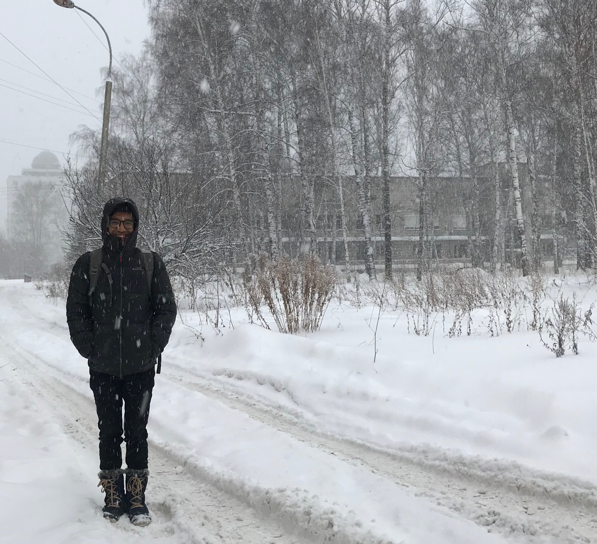

Hello from Novosibirsk, Siberia! The temperature outside is -9ºC, the streets are covered in fresh white snow, and I'm sipping hot chocolate at a cafe near the [Novosibirsk Opera and Ballet Theatre](https://en.wikipedia.org/wiki/Novosibirsk_Opera_and_Ballet_Theatre). I came here to speak about Rust and WebAssembly at [DevFest Siberia 2018](https://gdg-siberia.com), and I'm staying here for a few extra days so I can explore the city.

This is the first time in the 28 years I've been alive that I'm seeing snow. When I boarded my flight from Delhi I was afraid that I wouldn't be able to deal with the sub-zero temperatures in Siberia, but when I got here on Thursday I discovered that central heating exists. I'm glad to report that I'm cozy af, and the only time I have to deal with the cold is when I'm running from a building into my Yandex Taxi.

I think today I'll venture out for a long walk around the city center. Wish me luck.

* * *

Yesterday afternoon I spoke to an audience of about 150 people about drawing the Mandelbrot set on a `&lt;canvas&gt;` using Rust compiled to WebAssembly. While I knew my material well, I hadn't practiced verbally delivering my talk before I went on stage. The injury to my vocal cords still prevents me from speaking at length without pain, so all the run-throughs I'd done involved me mouthing words in front of a mirror.

Problem is, things sound way cooler when you say them in your head. When I actually vocalized my words in front of my audience, my jokes fell flat and the explanations that had sounded lucid and coherent in my head came out sounding ambiguous and confusing. Even the SpongeBob GIFs didn't do much to excite my audience.

I'm going to do this same talk at another conference in January next year, and I plan to start preparing for it as soon as I get back to Bangalore. The current state of my vocal cords makes it impossible for me to do multiple run-throughs of the talk in a single day, but I can certainly practice it once or twice a week so that I'm better prepared to go on stage by the time January rolls around.

A few specific things I noticed about my talk:

*   I have some math in my slides. While I explain it in human language during the talk, understanding it is not too important for the audience. It's not even complicated math; it's possible for me to translate it into plain English instead of presenting it using mathematical symbols. Doing that would make my talk far more engaging.
*   Before starting to explain the Rust code I've written for this talk, it might be a good idea for me to explain what I'm attempting to do in simple, high-level terms. This would allow people who miss out on some of the small details of my code to still understand what's happening in the talk as a whole.
*   Forty-five minutes is a _long_ time. I can be less conservative about what can be covered in forty-five minutes, and take my time to explain some of the trickier parts of my code.

* * *

In [last week's note](https://ankursethi.in/2018/11/18/week-2-going-to-siberia-why-weeknotes-and-being-a-jerk/), I mentioned that I wanted to write about a few reasons I've failed at doing my job effectively this year. I'm going to list them out now.

(For context, I recently stopped being a lone freelance developer and started working at [Uncommon](https://uncommon.is) so I can build a Web Engineering team here.)

**I don't ask for help when I need it most.** It's not because I feel I don't need it, or even that I'm ashamed of reaching out. It's genuinely something that does not occur to me at all. This is one of the reasons I've been a bad collaborator throughout my life. Too often, I've spent days researching solutions to a problem when I could have just walked across the office and asked somebody.

This is a habit that I'm slowly starting to change. I've been a lone-wolf (well, more a lone-puppy than a lone-wolf) developer for the last five years so it'll be a while before I learn how to work well with people. But I recognize that programming is a team sport, and I'm confident that I'll get there.

**I avoid tough conversations.** Just the thought of conflict makes me so anxious that it becomes hard to function. If I find myself in a difficult conversation with a client or co-worker, I'm so exhausted by the end of it that I can barely get work done for the rest of the day. This has cost me dearly in both my personal and professional life, and I honestly don't know how to fix this.

If you have any ideas, I'd love to hear from you over [email](mailto:contact@ankursethi.in) or [twitter](https://twitter.com/ankurs3thi).

**I overestimate my own abilities.** I feel everyone has been guilty of this at some point in their lives. It becomes a real problem when you end up burning yourself out or hurting yourself physically, both of which have happened to me a couple of times now.

As I grow older, I'm learning to anticipate my body's needs more and prioritizing my health over getting work done.

**I work reactively.** I often react to situations as they arise instead of planning ahead. This is frustrating because, if I'm spending all my time putting out fires, I'm not working on my long-term goals. This is another problem I don't know how to fix yet.

**I don't make full use of the resources available to me.** This is a strange one, and I still don't understand why I do it. Here's an example: I recently needed a spare Android phone to test something I'd been working on. The model I wanted cost about $150. Instead of just asking my company to buy me one—which they would have happily done—I spent a week looking for somebody who could lend me one for a few hours.

Recognizing these issues has taken me a long time, and dealing with them is going to take an even longer time. However, I'm grateful that I got this far. These are all normal issues that can be tackled, and I plan to do just that in the coming few months.

* * *

Reading: _Americanah_ by Chimamanda Ngozi Adichie.

Listening to: _FM!_ by Vince Staples, _CARE FOR ME_ by Saba, and _Be the Cowboy_ by Mitski.

Playing: _Diablo 3_, and _Mario + Rabbids: Kingdom Battle_.

* * *

Until next time, Ankur.