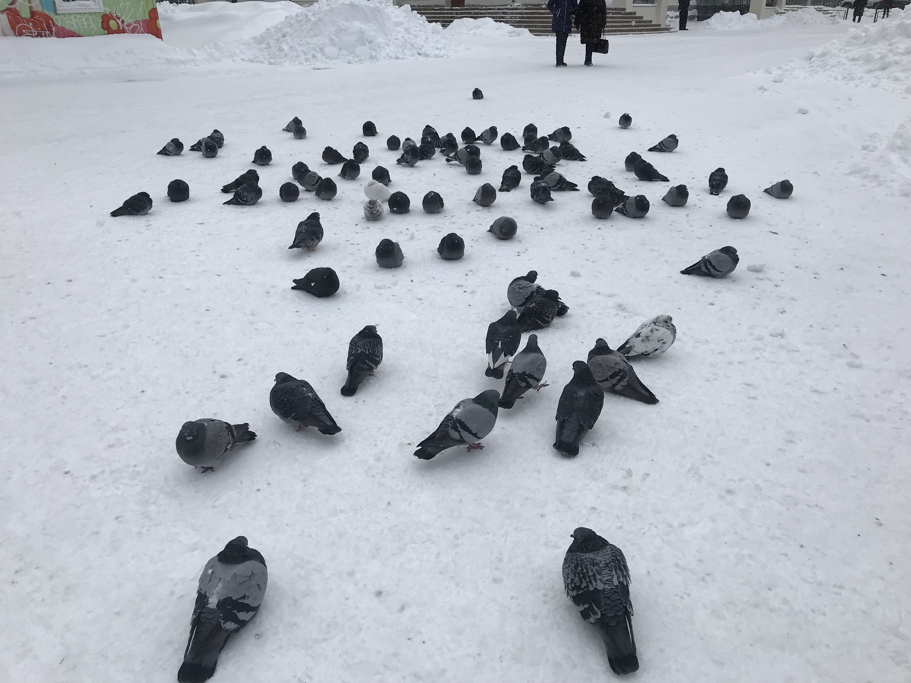

I survived Siberia! After [my talk](http://gdg-siberia.com) last Sunday, I had two days in Novosibirsk to spend as I pleased before my flight back to Delhi. I spent those days walking around the city center, [reading](https://en.wikipedia.org/wiki/No_Longer_at_Ease), and [writing](https://blog.uncommon.is/the-baseline-costs-of-javascript-frameworks-f768e2865d4a). The temperature fell to -13ºC while I was there, so I had to keep ducking into random cafes and restaurants every half an hour to keep myself warm. It goes without saying that I had a lot of caffeine in my system by the time I got back to my hotel each night.

Coming from a hot country like India, and having seen snow only on Christmas specials on TV, the city center looked like something out of a fairytale.

At one point I was walking through a park and spotted a flock of pigeons sitting in the snow (how!!?) When I went close to them to take a picture, the entire flock waddled towards me and surrounded me on all sides. They made themselves comfortable, ruffled their feathers until they were all big round grey balls of fuzz,  and stared at me in anticipation as I struggled to operate my phone with my freezing fingers. I think they were expecting me to feed them, but the only feed I had on me at the time was my Instagram feed (badum-tish). Sorry to disappoint, pigeons. Maybe next time.

I made sure to end each day in Novosibirsk with a bowl of [solyanka](https://en.wikipedia.org/wiki/Solyanka). My first order of business when I get back to Bangalore will be to figure out how to make this delicious soup in my own kitchen!

* * *

This year I've read several books about creativity and the creative habit, the most recent one being [_The Practicing Mind_](https://www.amazon.in/dp/B007C8NRSA/ref=dp-kindle-redirect?_encoding=UTF8&btkr=1) by Thomas M. Sterner. It puts into words many truths about creativity that I've discovered for myself over the last few years but haven't had the vocabulary to express.

While reading the book I had a realization: even though 2018 has been a terrible year for me in all respects, I've found a sense of peace and calm thanks to my own creative practice.

This year I've had to deal with failing health, close friends moving away, a wonderful relationship ending, a pet dying, and a frustrating career slump. Through all of this, I've found a sanctuary in writing and making music. The simple habit of sitting down at the same time each day, shutting out the world for a short time, and writing down one word after another has kept me grounded, sane, and oddly contented through these rough times.

The knowledge that I'll wake up tomorrow morning and spend some time writing gives me great comfort. I can only hope that I'm able to keep up with this habit long-term. It's something I would be devastated to lose in the chaos of everyday life.

* * *

One of my recent technical posts on the Uncommon blog—titled [The Baseline Costs of JavaScript Frameworks](https://blog.uncommon.is/the-baseline-costs-of-javascript-frameworks-f768e2865d4a?source=collection_home---4------0---------------------)—made it to the top of HN last week. I wasn't expecting it to blow up as fast or as much as it did, but the Internet is an unpredictable beast.

While I've had about 30k impressions on the post so far, it hasn't really generated any leads for new business. I can't say I was expecting it to get us new business immediately, but I do find it a little disappointing that it resulted in absolutely zero enquiries.

Ah well, on to the next one. I know that it takes a large body of work over a long period of time before writing and speaking starts to bring in prospective customers. Keeping that in mind, I've already started working on my next post.

In my head, an ideal situation would be to have enough content on the Uncommon blog to attract 250-300k monthly readers even when we're not actively writing. We can then begin to figure out how to convert these readers into clients. I'm confident we'll get there within 12-18 months of regular writing.

It's a long road ahead. Good thing writing is _so damn fun_.

* * *

**Reading:** _The Practicing Mind_ by Thomas M. Sterner

**Listening to:** _DiCaprio 2_ by JID, _CARE FOR ME_ by Saba, and _Be the Cowboy_ by Mitski

**Playing:** _Diablo 3_ and _Celeste_